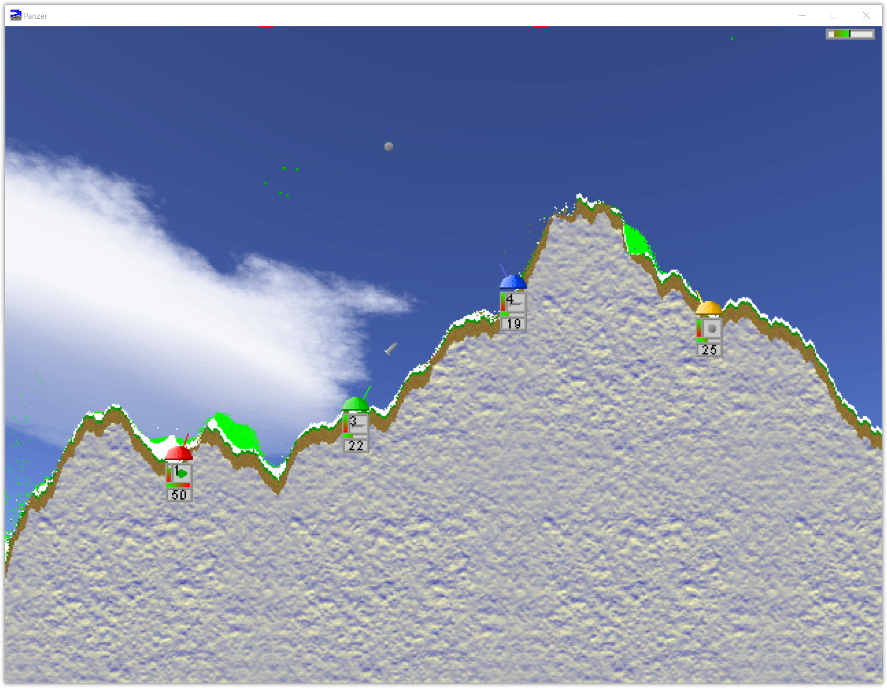

## Cannonhill

An SDL2 port of the [original cannonhill](https://dplate.de/games/cannonhill)
game. Cannonhill is a game where up to four people locally play against
eachother in a randomly generated terrain where each pixel is physically
calculated. Each player controls one cannon and has to shoot at the other
players. Last player standing wins the round.
